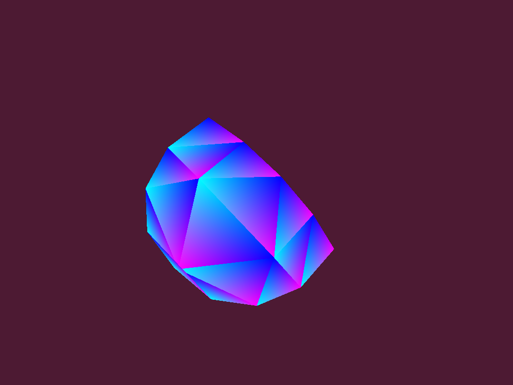

# RTXplay
A lab for playing around with NVIDIA's realtime ray tracing concept. The lab intends to migrate Pete Shirley's ray tracer presented in his book series [Ray Tracing in one weekend](https://github.com/RayTracing/raytracing.github.io/) (RTOW) to become Ray Tracing with OptiX (RTWO) which utilizes the new RT cores introduced by NVIDIA with Turing microarchitecture.

Code in the top-level folder was created while working through the [first book](https://raytracing.github.io/books/RayTracingInOneWeekend.html) of Pete's series. Creation followed the suggested method of typing yourself and foregoing copy and paste. Doing so there have been few changes to the code logic. Most changes concerned with style guide and naming.

The `optx` folder contains RTWO. Work started out with the *optixTriangle* sample from the OptiX SDK which has been modified step by step as shown by the repository's commit history.

First aim was a 1:1 port of RTOW to OptiX to get RTWO. Result is in `manastra` branch. After that, work proceeded with arbitrarily picked objectives to explore various OptiX features. See commit history of `main` branch for details.

### Build
Due to lack of appropriate hardware development and tests had been split on Windows and Linux respectively.

#### Windows (Development)
- Install Cygwin with development tools (GCC, make etc.)
- Install Visual Studio 2022 Community
- Install CUDA 12.1 (omit driver if lacking a GPU)
- Install Optix 7.6 SDK
- Add `nvcc.exe` and `cl.exe` to PATH
- Install ImageMagick 7 (Windows installer)
- Run `make` in top-level directory of repo to get RTOW
- Run `make`[^1] in `optx` directory to check compilation (no linking) of RTWO

[^1]: Run `unset TEMP` if set to folder with spaces in name.

#### Linux
- Get appropriate hardware, e.g. AWS EC2 instance type `g4dn.xlarge` with Amazon Linux 2 AMI
  ```
  # on first start
  sudo yum update -y
  sudo reboot
  ```

- Install CUDA Toolkit 11
  ```
  # prerequisites
  sudo yum group install "Development Tools"

  wget https://developer.download.nvidia.com/compute/cuda/11.4.0/local_installers/cuda_11.4.0_470.42.01_linux.run
  sudo sh cuda_11.4.0_470.42.01_linux.run

  # environment (~/.bashrc)
  export PATH=/usr/local/cuda/bin:$PATH
  export LD_LIBRARY_PATH=/usr/local/cuda/lib64:$LD_LIBRARY_PATH

  # check driver
  nvidia-smi

  # check toolkit
  cd NVIDIA_CUDA-11.4_Samples/1_Utilities/deviceQuery
  make ; ../../bin/x86_64/linux/release/deviceQuery ; cd
  ```

- Install OptiX 7 SDK
  ```
  # prerequisite
  sudo yum install -y cmake3 freeglut-devel libXcursor-devel libXinerama-devel libXrandr-devel

  sudo mkdir /usr/local/optix-7.3
  sudo ln -s /usr/local/optix-7.3 /usr/local/optix
  sudo sh NVIDIA-OptiX-SDK-7.3.0-linux64-x86_64.sh --prefix=/usr/local/optix-7.3 --exclude-subdir

  # environment (~/.bashrc)
  export LD_LIBRARY_PATH=~/optix-samples/lib:$LD_LIBRARY_PATH

  # check
  mkdir optix-samples ; cd optix-samples
  cmake3 /usr/local/optix/SDK ; make ; cd
  ```

- Install ImageMagick 7
  ```
  # prerequisites
  sudo yum install libpng-devel

  git clone https://github.com/ImageMagick/ImageMagick.git
  cd ImageMagick
  ./configure --disable-opencl ; make -j $(nproc) ; sudo make install
  ```

- Run `make` in `optx` directory of repo

### Gallery

|RTWO (Ray Tracing with OptiX) samples|   |
|:---|:---|
|1 spp (samples per pixel) in 189 milliseconds|50 spp in 776 milliseconds|
|||
|500 spp (default) in 5586 milliseconds|no defocus blur|
|||

|RTWO samples with experimental|triangle hit correction|made with branch `hitcorr`|
|:---|:---|:---|
|enabled for diffuse only|reflect added|refract added|
||||

|Sphere (subdivided tetrahedron)|samples made with [commit](https://github.com/otabuzzman/RTXplay/tree/e68dc9d7e28d1763c741d5efab63e3392b24a457)|   |
|:---|:---|:---|
|single triangle, no subdivision|1 subdivision|2 subdivisions|
||||
|3 subdivisions|4 subdivisions|5 subdivisions|
||||
|6 subdivisions|sphere (6 subdivisions)|triangled bounding box|
||||
