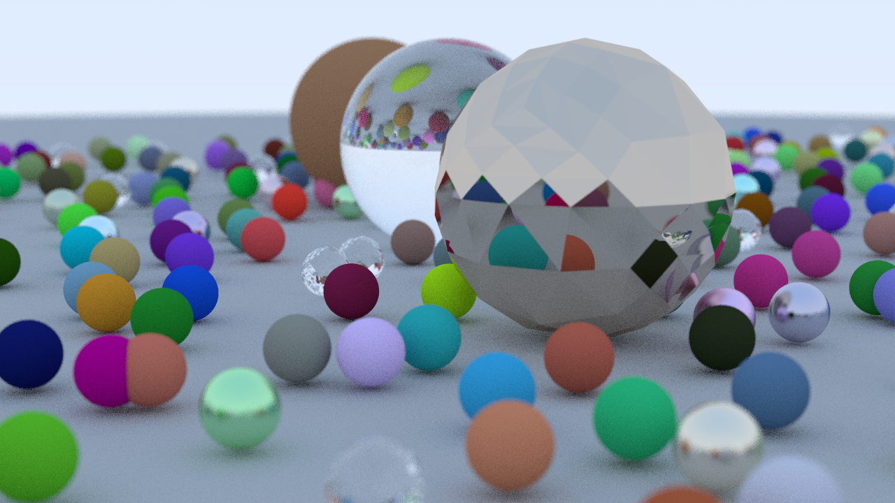
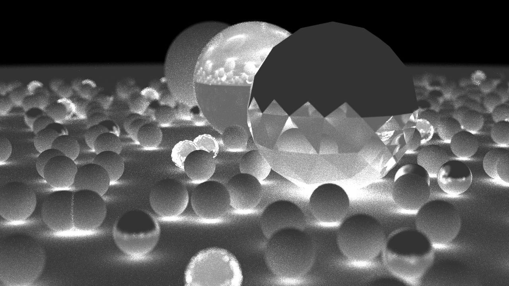

# RTWO
This is *Ray Tracing with OptiX* (RTWO), another implementation of the 1st book from Pete Shirley's instructive and entertaining [*Ray Tracing in One Weekend*](https://github.com/RayTracing/raytracing.github.io/) (RTOW) series. It runs in batch mode just like Pete's and turns interactive in case of an X server exec'ing on the same host. A rather simple UI provides camera and denoiser controls. The complete list of functions:
```
Usage: rtwo [OPTION...]
  rtwo renders the final image from Pete Shirley's book Ray Tracing in
  One Weekend using NVIDIA's OptiX Ray Tracing Engine and pipes the result
  (PPM) to stdout for easy batch post-processing (e.g. ImageMagick).

  If the host execs an X server (GLX enabled) as well, rtwo continuously
  renders and displays results. A (rather) simple UI allows for basic
  interactions.

Examples:
  # render and convert image to PNG. Print statistical information on stderr.
  rtwo -S | magick ppm:- rtwo.png

  # output image and AOV (yields rtwo-0.png (image) and rtwo-1.png (RPP)).
  rtwo --print-aov RPP | magick - rtwo.png

  # improve AOV RPP contrast.
  magick rtwo-1.png -auto-level -level 0%,25% rtwo-rpp.png

  # apply denoiser and output guide layers (yields rtwo-0.png (normals),
  # rtwo-1.png (albedos), and rtwo-2.png (image)).
  rtwo --print-guides --apply-denoiser NAA | magick - rtwo.png

Options:
  -g, --geometry {<width>[x<height>]|RES}
    Set image resolution to particular dimensions or common values predefined
    by RES.

    Prefedined resolutions for RES:
      CGA    - 320x200      8:5
      HVGA   - 480x320      3:2
      VGA    - 640x480      4:3
      WVGA   - 800x480      5:3
      SVGA   - 800x600      4:3
      XGA    - 1024x768     4:3
      HD     - 1280x720    16:9 (default)
      SXGA   - 1280x1024    5:4
      UXGA   - 1600x1200    4:3
      FullHD - 1920x1080   16:9
      2K     - 2048x1080  ~17:9
      QXGA   - 2048x1536    4:3
      UWHD   - 2560x1080  ~21:9
      WQHD   - 2560x1440   16:9
      WQXGA  - 2560x1600    8:5
      UWQHD  - 3440x1440  ~21:9
      UHD-1  - 3840x2160   16:9
      4K     - 4096x2160  ~17:9
      5K-UW  - 5120x2160  ~21:9
      5K     - 5120x2880   16:9
      UHD-2  - 7680x4320   16:9

    Default resolution is HD.

  -s, --samples-per-pixel N
    Use N samples per pixel (SPP). Default is 50.

  -d, --trace-depth N
    Trace N rays per sample (RPS). A minimum value of 1 means just trace
    primary rays. Default is 16 or 50, depending on whether rtwo was
    compiled for recursive or iterative ray tracing respectively.

  -a, --aspect-ratio <width>:<height>
    Set aspect ratio if not (implicitly) defined by -g, --geometry
    options. Default is 16:9 (HD).

  -v, --verbose
    Print processing details on stderr. Has impacts on performance.

  -t, --trace-sm
    Print FSM events and state changes to stderr (debugging).
    This option is not available in batch mode.

  -q, --quiet, --silent
    Omit result output on stdout. This option takes precedence over
    -A, --print-aov and -G, --print-guides options.

  -h, --help, --usage
    Print this help. Takes precedence over any other options.

  -A, --print-aov <AOV>[,...]
    Print AOVs after image on stdout. Option not available in interactive
    mode.

    Available AOVs:
      RPP (1) - Rays per pixel. Sort of `data' AOV (opposed to AOVs for
                lighting or shading). Values add up total number of rays
                traced for each pixel. Output format is PGM.

  -G, --print-guides
    Print denoiser guide layers before image on stdout. Available guide layers
    depend on denoiser type: SMP/ none, NRM/ normals, ALB/ albedos, NAA/ both,
    AOV/ both. Output format is PPM. Option not available in interactive mode.

  -S, --print-statistics
    Print statistical information on stderr.

  -D, --apply-denoiser <TYP>
    Enable denoiser in batch mode and apply type TYP after rendering with
    1 SPP. To enable for interactive mode see UI functions section below.
    Denoising in interactive mode applies to scene animation and while
    changing camera position and direction, as well as zooming.
    When finished there is a final still image rendered with SPP as given
    by -s, --samples-per-pixels or default.

    Available types for TYP:
      SMP (1) - A simple type using OPTIX_DENOISER_MODEL_KIND_LDR. Feeds raw
                RGB rendering output into denoiser and retrieves result.
      NRM (2) - Simple type plus hit point normals.
      ALB (3) - Simple type plus albedo values for hit points.
      NAA (4) - Simple type plus normals and albedos.
      AOV (5) - The NAA type using OPTIX_DENOISER_MODEL_KIND_AOV.
                Might improve denoising result even if no AOVs provided.

UI functions:
  window resize         - change viewport dimensions
  left button + move    - change camera position
  right button + move   - change camera direction
  right button + scroll - roll camera
  'a' key               - animate scene (<ESC> to stop)
  'b' key               - enter blur mode (<ESC> to leave)
      scroll (wheel)    - change defocus blur
  'd' key               - enable/ disable denoising and select
                          type (loop)
  'f' key               - enter focus mode (<ESC> to leave)
      scroll (wheel)    - change aperture
  'z' key               - enter zoom mode (<ESC> to leave)
      scroll (wheel)    - zoom in and out
  <ESC> key             - leave rtwo
```

### Gallery
|    |    |
|:---|:---|
|1) The well-known image from [RTOW chapter 13](https://raytracing.github.io/books/RayTracingInOneWeekend.html#wherenext?) rendered with 50 samples per pixel (SPP). Small glass spheres and the large sphere in the foreground show faceted surfaces, due to coarser triangle-meshes.|2) AOV reflecting number of rays per pixel (the brighter the more).|
|||
|3) SMP (simple) denoiser result. Mind the yellow artifacts but all in all pretty good considering only 1 SPP.|4) NRM denoiser with normals guide layer. More artifacts and quite fuzzy, thus slightly worse than SMP.|
|||
|5) ALB denoiser with albedos guide layer. Even more artifacts but less fuzzy. Better than NRM, but still worse than SMP.|6) NAA denoiser with both<br>(so far all OPTIX_DENOISER_MODEL_KIND_LDR). Result comparable to previous.|
|||
|7) AOV denoiser with both (no AOV)<br>(OPTIX_DENOISER_MODEL_KIND_AOV). Looks good. Few artifacts with acceptable fuzzyness. Flip a coin to pick SMP or AOV.|8) Denoiser guide layer showing normals.|
|||
|9) Denoiser guide layer showing albedos.||
|||

### Build
On your Linux box with NVIDIA Turing or Ampere graphics card install these (cues in Linux section of [../README.md](../README.md#linux)):
- Common development tools (gcc, g++, make ...)
- CUDA 11.4
- OptiX 7.3
- ImageMagick 7
- GLFW (see [below](#compile-optiX-7-course))
- Download RTXplay repo (this)
- Run `make` in `optx` subfolder (follow first-time instructions for GLAD)
- Run `make` again

If all went well you now have `rtwo.png`.

- Start X server
- Run `DISPLAY=:0 ./rtwo` (interactive now)

### No Turing or Ampere
RTWO should work on older architectures as well, of course without RT Cores then. In `Makefile` set `-arch` flag in `NVCCFLAGS` variable according to architecture in question ([list](https://docs.nvidia.com/cuda/cuda-compiler-driver-nvcc/index.html#virtual-architecture-feature-list)) before compiling.

### No NVIDIA graphics card
Try a cloud service. RTWO developement actually happened on Windows and got its final cut on AWS. Any other provider should do as well. See [README.md](../README.md) in parent folder for setting up Windows and AWS. 

### Which file for what
|File|Comment|
|:---|:------|
|`rtwo.cxx`|The `main` function with a long piece of spaghetti code still reflecting the program structure of `optixTriangle`, the OptiX SDK sample RTWO was derived from.|
|`args.cxx`|Command line argument processing.|
|`scene.cxx`|A collection of things.|
|`thing.h`|A generalization of a *Thing* in a scene as seen by *Hit Group* programs. Actually a `struct` carried onto device via SBT record.|
|`object.cxx`|A tool to read in a single scene object from a Waveform OBJ file.|
|`simpleui.cxx`|The CUDA OpenGL interop code to continuously render on X, as well as input event handling.|
|`frag.gsgl`<br>`vert.gsgl`|Generic OpenGL fragment and vertex shaders.|
|`paddle.cxx`|An abstraction of a control device inspired by the `Trackball` class in sutils of the OptiX SDK (name taken from Atari's [Pong](https://en.wikipedia.org/wiki/Pong) game).|
|`simplesm.cxx`|A finite state machine for UI event processing. Core is a state/ event table with actions represented by functions called on events and leading from current to next state.|
|`camera_i.cu`<br>`camera_r.cu`|Interactive and recursive versions of *Ray generation* (RG) and *Miss* (MS) programs.|
|`optics_i.cu`<br>`optics_r.cu`|Interactive and recursive versions of *Closest-hit* (CH) programs für diffuse, reflecting and refracting surfaces.|
|`denoiser.cxx`|Various denoisers. 1) A simple one (SMP) only having set OPTIX_DENOISER_MODEL_KIND_LDR, 2) the simple one plus normals guide layer (NRM), 3) the simple again plus albedos guide layer (ALB), 4) one more simple plus normals and albedos guide layers (NAA), and 5) finally the AOV denoiser with both guide layers and model kind OPTIX_DENOISER_MODEL_KIND_AOV but no AOVs.|
|`sphere.cxx`|A tool to create triangle-meshed sphere approximations in Wavefront OBJ file format. Actually a tetrahedron *pumped up* by recursively subdividing triangular surfaces.|
|`glxview.cxx`|A simple GLX viewer for X written to practice CUDA OpenGL interop (beyond that not used by RTWO).|
|`reduce.cxx`|A lab to generate indexed vertice lists. (beyond that not used by RTWO).|

### Simple GPU workstation on AWS (VNC)
The faster RDP would have been a better approach but it's not compatible with NVIDIA's GLX for Xorg (see [xrdp issues](https://github.com/neutrinolabs/xrdp/issues/721#issuecomment-293241800) *xorgxrdp driver not supporting Nvidia's GLX* [and](https://github.com/neutrinolabs/xrdp/issues/1550#issuecomment-614910727) *not seen that (Nvidia's GLX) work yet with xrdpdev*) which has been confirmed by tests with numerous configurations which all failed. Due to these obstacles and despite it is slow, falling back on VNC is considered ok because it works after all and it's only for testing anyway.

Steps below assume an [AWS EC2 G4 instance](https://aws.amazon.com/ec2/instance-types/g4/) (`g4dn.xlarge`) with [Amazon Linux 2 AMI](https://aws.amazon.com/amazon-linux-2/).

1. Install X
  ```
  # install server
  sudo yum install -y xorg-x11-server-Xorg

  # configure Xorg for NVIDIA
  sudo X -configure
  sudo mv /root/xorg.conf.new /etc/X11/xorg-nvidia.conf
  ```

2. Install LibVNC
  ```
  # clone libvncserver
  cd ~/lab ; git clone https://github.com/LibVNC/libvncserver.git ; cd libvncserver

  # build libvncserver
  mkdir build ; cd build ; cmake3 .. \
  	-DWITH_OPENSSL=ON \
  	-DWITH_GCRYPT=OFF \
  	-DWITH_GNUTLS=OFF ; make

  # install libvncserver
  sudo make install

  # prerequsites
  sudo yum install -y libXtst-devel openssl-devel

  # clone x11vnc
  cd ~/lab ; git clone https://github.com/LibVNC/x11vnc.git ; cd x11vnc

  # build x11vnc
  export LIBVNCSERVER_CFLAGS=-I/usr/local/include/rfb
  export LIBVNCCLIENT_CFLAGS=-I/usr/local/include/rfb
  export LIBVNCSERVER_LIBS="-L/usr/local/lib64 -lvncserver"
  export LIBVNCCLIENT_LIBS="-L/usr/local/lib64 -lvncclient"

  autoreconf -fiv
  ./configure ; make

  # install x11vnc
  sudo make install
  ```

3. Check configuration
  ```
  # start X server
  sudo X -ac -config /etc/X11/xorg-nvidia.conf &

  # start VNC server
  export LD_LIBRARY_PATH=/usr/local/lib64:$LD_LIBRARY_PATH
  x11vnc -display :0 &

  # set password for `ec2-user'
  sudo passwd ec2-user
  ```

  [Download](https://www.realvnc.com/de/connect/download/viewer/windows/) and install VNC viewer

  Login as `ec2-user` with VNC viewer

  Run OptiX 7 course examples (within SSH session)
  ```
  cd ~/lab/optix7course/build

  DISPLAY=:0 ./ex03_testFrameInWindow
  ```

  Try iOS version of VNC viewer

### Performance cues

#### Low hangings
- Use iterative instead of recursive raytracing

  `Makefile` defaults to *iterative* but repo contains programs (`*.cu`) for both.
  ```
  # to try recursive
  make lclean
  CXXFLAGS=-DRECURSIVE make
  ```
- Use full optimization (`OPTIX_COMPILE_OPTIMIZATION_DEFAULT`) for module compilation
- Use `Frand48` (default) instead of CUDA `curand` RNG

  `Makefile` defaults to `Frand48` but code supports both.
  ```
  # try curand
  make lclean
  CXXFLAGS=-DCURAND make
  ```
- Try `OPTIX_GEOMETRY_FLAG_NONE` instead of `OPTIX_GEOMETRY_FLAG_DISABLE_ANYHIT` (`rtwo.cxx`, `*.cu`)

  OptiX documentation and develper forum recommend use of `OPTIX_GEOMETRY_FLAG_DISABLE_ANYHIT` even if there is no Anyhit Program at all. See [time series chart](https://docs.google.com/spreadsheets/d/1HAkMM2-QL5F1pwvjQTtyEAV1Zo2fghDp/edit?usp=sharing&ouid=100581696502355527803&rtpof=true&sd=true) for comparisons of various measures.

#### Kernel profiling with Nsight Compute
- Install [Nsight Compute 2021.2](https://developer.nvidia.com/gameworksdownload#?dn=nsight-compute-2021-2-1) (Windows version)
- Nsight Compute CLI (`ncu`) is part od CUDA Toolkit
- Compile RTWO to provide line information to Nsight (default)<br>
  Run NVCC with `-lineinfo` option (`NVCCFLAGS` variable in `Makefile`)<br>
  Set `OptixModuleCompileOptions.debugLevel = OPTIX_COMPILE_DEBUG_LEVEL_LINEINFO` (`rtwo.cxx`)

- Run `ncu` on OptiX app (mind [developer forum thread on kernel selection](https://forums.developer.nvidia.com/t/optix-and-performance-counter-reports-in-nsight-compute/180642))
  ```
  # ncu options:
  # -k regex:raygen    : RG kernel to profile (cannot HG, MS etc.)
  # --section regex:.* : record data for all sections (ncu -list-sections for all)
  # -f                 : force overwrite report file
  # -o rtwo            : report file (.ncu-rep auto-suffixed)

  ncu \
    -k regex:raygen    \
    --section regex:.* \
    -f                 \
    -o rtwo            \
    ./rtwo -q
  ```
- Analyse report in Nsight Compute GUI

### Compile OptiX 7 course
Steps below assume a working instance of the [RTXplay](https://github.com/otabuzzman/RTXplay) repo.

1. Install GLFW
  ```
  # prerequsites
  sudo yum install -y libXi-devel

  # clone GLFW
  cd ~/lab ; git clone https://github.com/glfw/glfw.git ; cd glfw

  # build GLFW
  mkdir build ; cd build ; cmake3 .. ; make

  # install GLFW
  sudo make install
  ```

2. Install OptiX 7 course tutorial
  ```
  # clone optix7course (fork)
  cd ~/lab ; git clone https://github.com/otabuzzman/optix7course.git ; cd optix7course

  # build optix7course
  mkdir build ; cd build ; OptiX_INSTALL_DIR=/usr/local/optix cmake3 .. ; make

  # check (no X required)
  ./ex01_helloOptix
  ./ex02_pipelineAndRayGen
  ```
